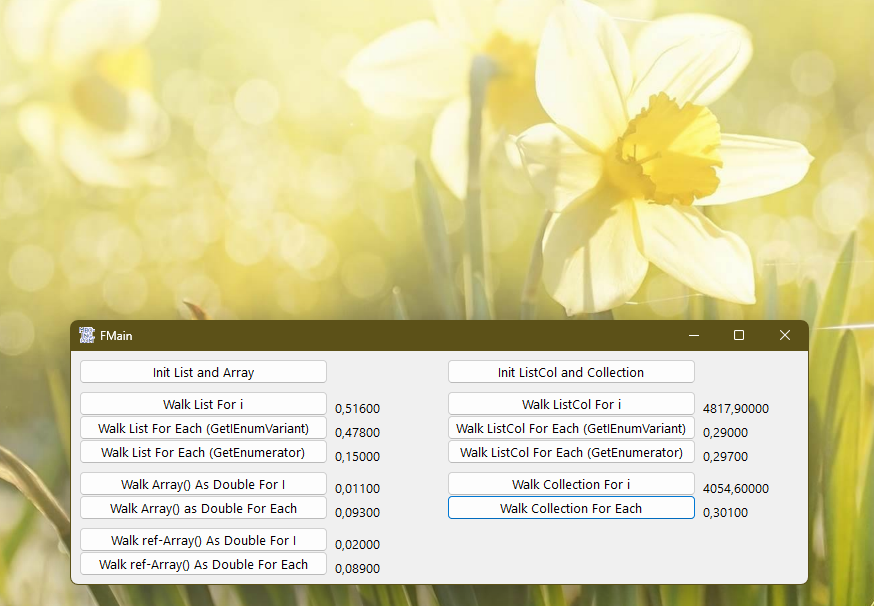

# LwO_IEnumVariant  
## Implementing IEnumVariant in a lightweight object  

 

Project started around mid 2012.  
This example shows how to implement the IEnumVariant-Interface for supporting the "for each"-language-feature in your own list class, by using a lightweight-object.  
The contained list-class is just an example of a prototype of a list.  

